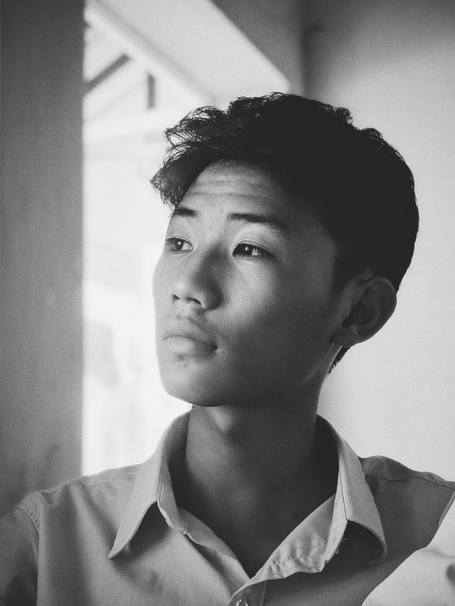

 
 
Hi, I am a student exploring the symbiotic relationship between biological and synthetic entities. My preference lies in spending time on building tools that offer humans an additional perspective on the complexity of the natural world.

At times i also make feeble attempts to delve deeper into the realm of science fiction and philosophical litreatures to gain alternate perspective on the human condition and explore the possiblities of the fucture.

